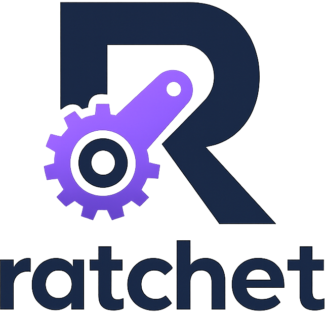

# Ratchet



A Python-first optimizer for agents.

You provide an agent and an eval set. Ratchet keeps the original agent as a frozen baseline, proposes typed program transforms against the surface your adapter declares, and promotes a candidate only if it beats the baseline on a protected holdout. The search planner and candidate implementer are LLMs, but every output is constrained to a typed schema and validated before it touches eval.

## Demo results

48-case order-desk tool-loop benchmark, `gemini-2.5-flash` baseline:

| | Baseline | After Ratchet |
|---|---|---|
| Holdout pass rate | 62.5% | 81.25% (+30% rel.) |
| `cancel` slice | 58% | 100% |
| `address` slice | 92% | 100% |
| `ambiguity` slice | 0% | 25% |
| Mean cost / case | $0.0018 | $0.0016 |
| Mean tool calls / case | 3.04 | 2.79 |

Total optimizer spend: $0.88. The winning candidate was a `before_tool_call` precondition that tracks inspected `order_id`s in agent state and forces `get_order` before any mutation, plus a `domain_policy` patch for ambiguous requests.

```
python3 -m ratchet optimize --config demo/ratchet.diagnostic_expanded.toml
```

## Pipeline

```
AgentHarness -> AdapterGenerator -> SurfaceSpec -> SurfaceOpportunity[]
  -> BaselineEvaluation -> EvidencePacket -> SearchPlan
  -> CandidateProposal[] -> TransformProgram -> CompiledCandidate
  -> EvidenceLedger -> FrontierUpdate -> HoldoutValidation
```

Measurement is staged: smoke, small-dev, full-dev, confirmation, holdout. See [docs/architecture.md](docs/architecture.md) and [docs/release.md](docs/release.md).

## Quickstart

```
python3 -m ratchet init --template python_function --out my-agent
python3 -m ratchet check    --config my-agent/ratchet.toml
python3 -m ratchet optimize --config my-agent/ratchet.toml
```

Other commands: `eval-health`, `release-check`, `assess-ideation`. Copy `.env.example` to `.env` and set `OPENAI_API_KEY` for live runs.

## Adapter contract

```
surface_spec(cases) -> SurfaceSpec
agent_spec()        -> AgentSpec
run_case(case, candidate=None) -> RunRecord
grade(case, output) -> GradeResult
export(candidate, out_dir) -> None
```

The adapter owns request construction, output parsing, and grading. Ratchet owns hook execution, transform compilation, and the model-call runtime. `candidate=None` means the original agent.

For single-call agents, write a small harness and let Ratchet generate the adapter:

```
adapter = AdapterGenerator().build_runtime_adapter(harness)
```

For multi-turn tool-using agents, return the full trajectory through `DiagnosticTrace`, or use `GeneratedToolLoopAdapter` to let Ratchet own the model/tool loop.

## Config

```
[ratchet.objective]
mode = "correctness"  # correctness | cost | latency

[ratchet.objective.constraints]
allowed_models = ["gpt-4o-2024-08-06", "gpt-5.4-mini"]
max_cost_ratio = 1.0
max_latency_ratio = 1.1
max_transform_operations = 8
```

`ratchet init` writes a populated `ratchet.toml`. The demo configs in [demo/](demo/) are working references.

## Outputs

Each run writes typed event logs, a resumable per-case cache, the selected candidate, and a rendered `summary.html` / `report.md` to its output directory. The cross-run per-case cache lives at `.ratchet/cache/`.
